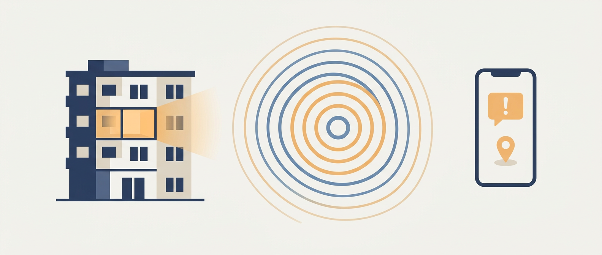

# Israel Home Front Ideas

A small collection of ideas I've jotted down for improving home front alerting in Israel (Pikud HaOref / פיקוד העורף), accumulated over the course of living through the two wars with Iran.

> These suggestions are offered with humility and the deepest respect for the people at Pikud HaOref and the emergency services who have kept us safe. I'm not a defense professional — just a resident who has spent a lot of time in a mamad, thinking about small UX and communication improvements that might help others. Ideas are shared in good faith, with no claim to expertise, and in the hope that even one might be useful.

**[Download the full collection as a PDF](build/Israel-Home-Front-Ideas.pdf)**

## How this repo is organised

Ideas are grouped into thematic sections. Each idea follows a simple template:

- **Problem** — what I noticed wasn't working well, or could be better.
- **Suggested solution** — a rough sketch of what might help.

## Index of ideas

### 1. The official app (Pikud HaOref app)
_Ideas related to the official alerting app — notifications, UX, accessibility, reliability._

<!-- ideas to be added -->

### 2. Siren & alert delivery
_Ideas about how alerts reach people: sirens, push notifications, SMS, cell broadcast, fallback channels._

- [Integrate Home Front Command alerts with traffic light SCADA](ideas/siren-alert-delivery/traffic-light-scada-integration.md) — clear the roads and give motorists an in-band visual cue during alerts.

### 3. Information during and after an event
_What people need to know once an alert fires: all-clear signals, impact information, guidance._

- [Distinct stand-down state when an early warning is not followed by a red alert](ideas/info-during-after/early-warning-without-alert-state.md) — close the ambiguity loop with its own message variant.
- [Add a "current guidance" field to the alert data feed](ideas/info-during-after/current-guidance-field-in-feed.md) — make the standing instruction explicit instead of inferred.

### 4. Accessibility & inclusion
_Making alerts work for everyone: olim, tourists, people with disabilities, the elderly, non-Hebrew speakers._

<!-- ideas to be added -->

### 5. Shelters & mamad logistics
_Ideas around public shelters, mamad readiness, and information about the nearest safe space._

The shelter ideas form a layered stack — institution → data → app — and are best read together:

- [Public shelter authority](ideas/shelters-mamad/public-shelter-authority.md) — *institution layer.* National body, GIS register, viability code, inspection and enforcement.
- [Standard listing format and physical wayfinding](ideas/shelters-mamad/standard-listing-format-and-wayfinding.md) — *data layer.* Machine-readable lists, precise coordinates, documented access routes.
- [Mandatory municipal shelter-finder app](ideas/shelters-mamad/municipal-shelter-finder-app.md) — *consumer layer.* Geolocated, accessible, photos/videos, single source of truth.
- [Communications redundancy as a baseline duty in every public shelter](ideas/shelters-mamad/comms-redundancy-in-shelters.md) — cellular, Wi-Fi, hardened WEA tablet, and AM/FM radio in every shelter.
- [Long-stay amenities — fewer but better-equipped shelters](ideas/shelters-mamad/long-stay-amenities.md) — mattresses, earplugs, AC, and the explicit trade-off.

### 6. Data, APIs & developer ecosystem
_The infrastructure around alert data: public feeds, APIs, MCP servers, and the community of apps that depend on them._

- [Provide a public and documented API](ideas/data-apis/public-documented-api.md) — replace the scraper sprawl with a professionally managed source of truth.
- [Formally model the alert payload schema from real captured data](ideas/data-apis/formal-payload-model.md) — derive a canonical JSON Schema from observed traffic.
- [Observed payload schema (v0)](ideas/data-apis/observed-payload-schema.md) — empirical model from a live capture, kicking off the formal-model effort.
- [Official multilingual area names + stable area IDs](ideas/data-apis/official-multilingual-area-names.md) — kill the per-app translation tables that break for non-Hebrew speakers.

### 7. Miscellaneous
_Everything else._

<!-- ideas to be added -->

---

_Status: placeholder — ideas will be filled in over time._
